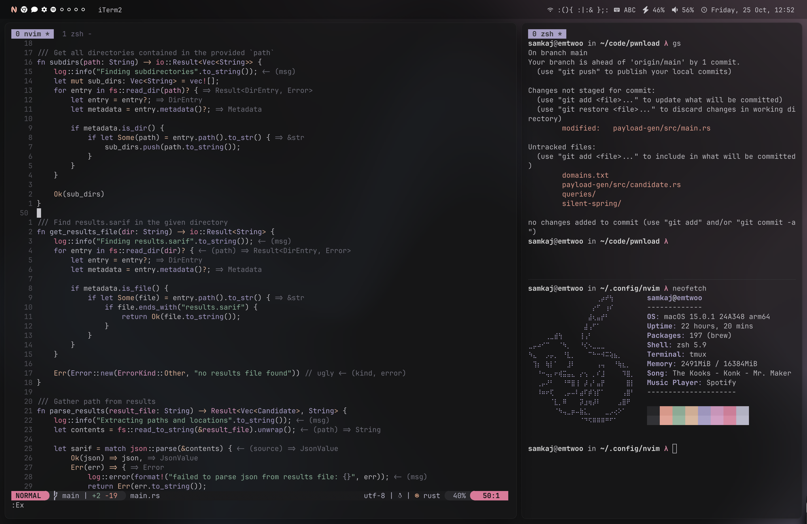

# samkaj's macOS rice

## Software used

- `neovim` - editor
- `aerospace` - window manager
- `sketchybar` - bar
- `raycast` - spotlight replacement
- `iTerm2` - terminal emulator

## MacOS settings

I always use the latest MacOS version.

- `Desktop & Dock > Automatically hide and show the Dock`
- `Control Centre > Automatically hide and show the menu bar > Always`

## Misc

- `font` - JetBrainsMono Nerd Font Mono
- `wallpaper` - Generated with [color4bg.com](https://www.color4bg.com/en/)
